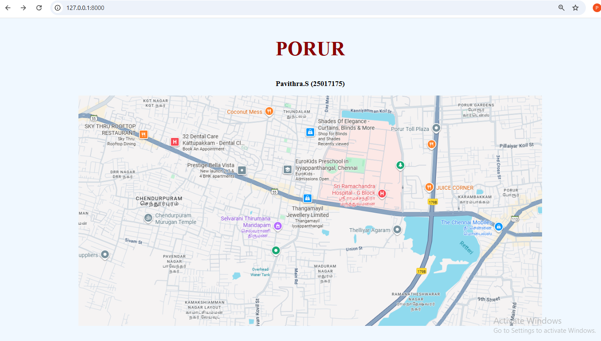
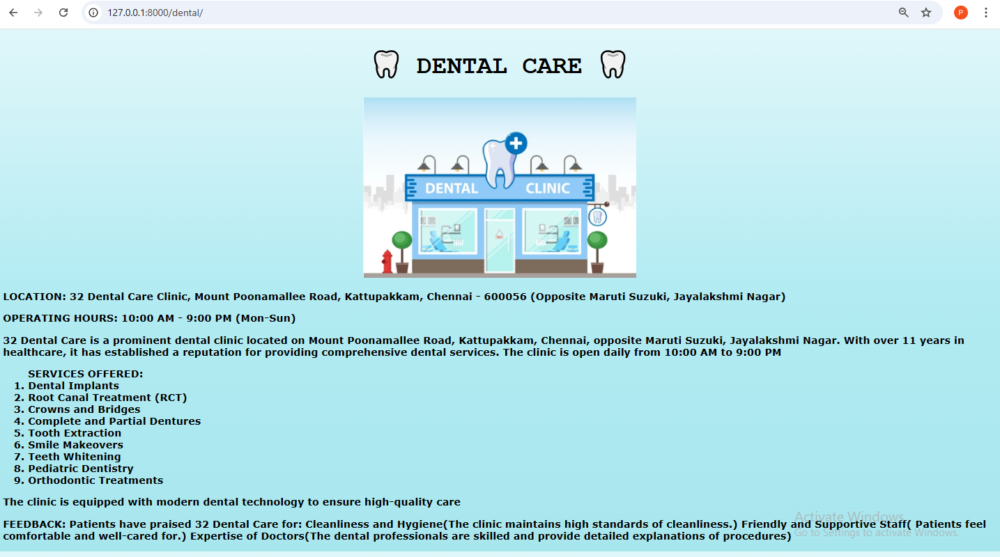
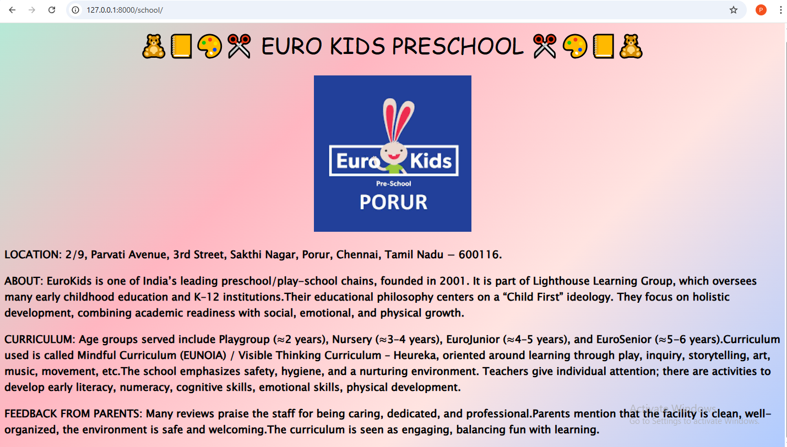
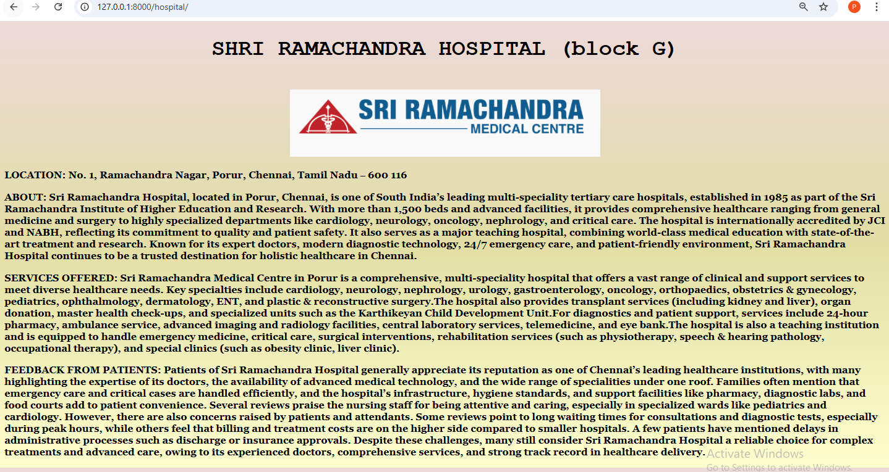
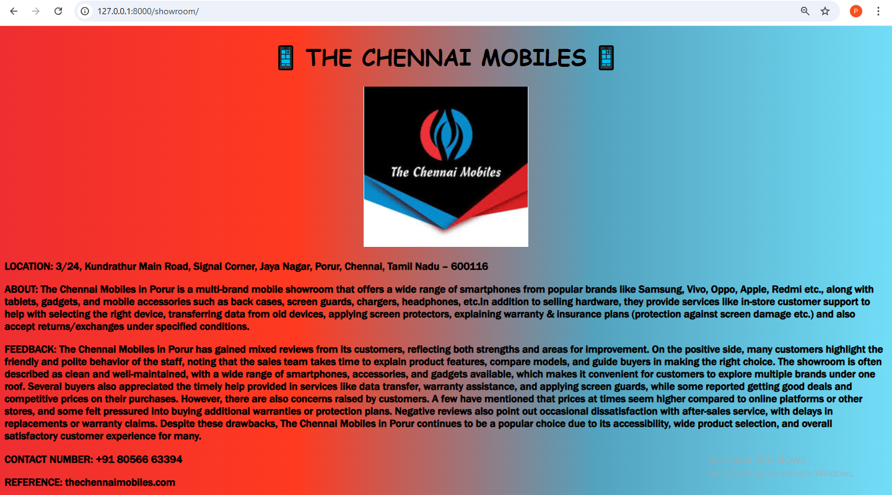

# Ex04 Places Around Me
# Date:
# AIM
To develop a website to display details about the places around my house.

# DESIGN STEPS
## STEP 1
Create a Django admin interface.

## STEP 2
Download your city map from Google.

## STEP 3
Using <map> tag name the map.

## STEP 4
Create clickable regions in the image using <area> tag.

## STEP 5
Write HTML programs for all the regions identified.

## STEP 6
Execute the programs and publish them.

# CODE
```
map.html

<!DOCTYPE html>
<html lang="en">
<head>
    <meta charset="UTF-8">
    <meta name="viewport" content="width=device-width, initial-scale=1.0">
    <title>Document</title>
</head>
<body style="background-color: aliceblue;"> 
    <center>
   
    
    <h3 style="color: darkred; font-size:50px;"> PORUR </h3>
    <h3> Pavithra.S  (25017175)</h3>
    
    <map name="map">
    <area shape="rect" coords="30,75,170,120" href="" title="SKY THRU ROOFTOP RESTAURANT ">
    <area shape="rect" coords="230,100,320,160" href="" title="DENTAL CARE" >
    <area shape="rect" coords="526,175,660,200" href="" title="EURO PRESCHOOL">
    <area shape="rect" coords="926,320,1078,353" href="" title="THE CHENNAI MOBILES">
    <area shape="rect" coords="660,230,790,264" href="" title=" SRI RAMACHANDRA HOSPITAL(block G)">
    </map>
    
</center>
</body>
</html>

restaurant.html
 
<!DOCTYPE html
<html lang="en">
<head>
    <meta charset="UTF-8">
    <meta name="viewport" content="width=device-width, initial-scale=1.0">
    <title>Document</title>
</head>
<style>
    h1{
        
        color:#82204A;
        font-size:40px;
    }
    p{
        font-weight: bolder;
        font-family: cursive;
    }
    body{
        background-color:#E7cFCD;
        font-size: large;
    }
</style>
<body>
    <center>
    <h1>🍽️ SKY THRU ROOFTOP RESTAURANT 🍽️ </h1>
    </center>
    <p>
     LOCATION: Plot Number 12, Mount Poonamallee Road, Kattupakkam (also sometimes listed as Mount Poonamalle Road) in Chennai, Tamil Nadu.
    </p>
    <P>
     TYPE & STYLE: It's a rooftop restaurant offering an open-air/rooftop seating experience. The ambience is described as casual, cosy, with romantic touches. Sometimes has live music.
    </P>
    <p>
        CUISINE: North Indian is one of the primary cuisines. The menu also leans toward variety including dishes like biryani, some seafood etc.
    </p>
     <p>
    Hours: Generally open for lunch and dinner. According to listings, hours are something like 12:30 PM to 3:30 PM for lunch, then 6:30 PM to 11:00 PM for dinner.
     </p>
    <p>
     SPECIALITY: Chicken Lollipop comes up several times in reviews as one of the standout starters. The crispy, flavourful chicken lollipop appears to be a crowd-pleaser. The biryani (especially prawn biryani) gets praise, also other non-vegetarian dishes are regarded well. People often say non-veg items are better than some of the veg offerings. Since rooftop restaurants often emphasise barbecue or tandoor cooking (smoking, grilling, richer flavours), items like kebabs, tandoori stuff likely feature among what they do well. Some reviews mention interesting welcome drinks or creative non-alcoholic beverages that people appreciated, especially those which balance sweetness, freshness (fruits), etc.  
    </p>
    <p> 
     OVERALL FEEDBACK: Sky Thru Rooftop Restaurant in Chennai enjoys a strong reputation with ratings around 3.8 out of 5, and much of that positivity comes from the unique dining experience it offers. Guests consistently praise the beautiful rooftop ambience, with its open-air seating, cozy lighting, and relaxed atmosphere that makes it a perfect choice for date nights, family dinners, or special occasions. The service staff are often highlighted for their polite and attentive approach, making diners feel welcomed and comfortable. On the food front, several dishes have become customer favourites — especially the chicken lollipop, prawn biryani, and grilled starters, which many say are flavourful and satisfying. While prices lean toward the higher side, most visitors feel the overall combination of good food, courteous service, and a refreshing rooftop view more than makes up for it. In short, the restaurant’s positive ratings reflect its ability to deliver not just a meal, but a pleasant and memorable dining experience.
    </p>

</body>
</html>

dental.html

<!DoCTYPE html>
<html lang="en">
<head>
    <meta charset="UTF-8">
    <meta name="viewport" content="width=device-width, initial-scale=1.0">
    <title>Document</title>
</head>
<style> 
    h1{
        font-size: 40px;
        font-family: 'Courier New', Courier, monospace;
        font-weight:800;
    } 
    body{
        font-family: Verdana, Geneva, Tahoma, sans-serif;
        font-weight: 700;
        background: linear-gradient(
        180deg,
        #E0F7FA 0%,   /* very light cyan for a clean feel */
        #B2EBF2 50%,  /* soft cyan-blue */
        #a8e6ee 100%  /* slightly deeper blue for depth */
    );

    }
</style>
<body>
    <center>
    <h1>🦷 DENTAL CARE 🦷</h1>
    
    </center>
    <p> LOCATION: 32 Dental Care Clinic, Mount Poonamallee Road, Kattupakkam, Chennai - 600056 (Opposite Maruti Suzuki, Jayalakshmi Nagar)</p>
    <P> OPERATING HOURS: 10:00 AM - 9:00 PM (Mon-Sun) </P>
   <p>32 Dental Care is a prominent dental clinic located on Mount Poonamallee Road, Kattupakkam, Chennai, opposite Maruti Suzuki, Jayalakshmi Nagar. With over 11 years in healthcare, it has established a reputation for providing comprehensive dental services. The clinic is open daily from 10:00 AM to 9:00 PM</p>
    <ol>SERVICES OFFERED:
        <li>Dental Implants</li>
        <li>Root Canal Treatment (RCT)</li>
        <li>Crowns and Bridges</li>
        <li>Complete and Partial Dentures</li>
        <li>Tooth Extraction</li>
        <li>Smile Makeovers</li>
        <li>Teeth Whitening</li>
        <li>Pediatric Dentistry</li>
        <li>Orthodontic Treatments</li>
    </ol>
    <p>The clinic is equipped with modern dental technology to ensure high-quality care</p>
    <p>FEEDBACK: Patients have praised 32 Dental Care for:

Cleanliness and Hygiene(The clinic maintains high standards of cleanliness.)

Friendly and Supportive Staff( Patients feel comfortable and well-cared for.)

Expertise of Doctors(The dental professionals are skilled and provide detailed explanations of procedures)</p>

    
</body>
</html>

school.html

<!DOCTYPE html>
<html lang="en">
<head>
    <meta charset="UTF-8">
    <meta name="viewport" content="width=device-width, initial-scale=1.0">
    <title>Document</title>
</head>
<style>
    h1{
        font-size:40px;
        font-weight: 300;
        font-family:'Indie Flower',cursive;
    }
    body{
        font-size: larger;
        font-family: 'Lucida Sans', 'Lucida Sans Regular', 'Lucida Grande', 'Lucida Sans Unicode', Geneva, Verdana, sans-serif;
   background: linear-gradient(
  135deg,
  #B5EAD7,  /* pastel mint */
  #FFB6C1,  /* soft pink */
  #FFE4E1,  /* blush peach */
  #AFCBFF   /* baby blue */);
    font-weight: bolder;
    }
</style>
<body>
    <center>  
 <h1> 🧸📒🎨✂️ EURO KIDS PRESCHOOL ✂️🎨📒🧸</h1>
 
  </center>
  <p>LOCATION:  2/9, Parvati Avenue, 3rd Street, Sakthi Nagar, Porur, Chennai, Tamil Nadu − 600116.</p>
  <p>ABOUT:  EuroKids is one of India’s leading preschool/play-school chains, founded in 2001. It is part of Lighthouse Learning Group, which oversees many early childhood education and K–12 institutions.Their educational philosophy centers on a “Child First” ideology. They focus on holistic development, combining academic readiness with social, emotional, and physical growth.</p>
  <p>CURRICULUM:  Age groups served include Playgroup (≈2 years), Nursery (≈3–4 years), EuroJunior (≈4–5 years), and EuroSenior (≈5-6 years).Curriculum used is called Mindful Curriculum (EUNOIA) / Visible Thinking Curriculum – Heureka, oriented around learning through play, inquiry, storytelling, art, music, movement, etc.The school emphasizes safety, hygiene, and a nurturing environment. Teachers give individual attention; there are activities to develop early literacy, numeracy, cognitive skills, emotional skills, physical development.</p>
  <p> FEEDBACK FROM PARENTS:  Many reviews praise the staff for being caring, dedicated, and professional.Parents mention that the facility is clean, well-organized, the environment is safe and welcoming.The curriculum is seen as engaging, balancing fun with learning.</p>
</body>
</html>

showroom.html

<!DOCTYPE html>
<html lang="en">
<head>
    <meta charset="UTF-8">
    <meta name="viewport" content="width=device-width, initial-scale=1.0">
    <title>Document</title>
</head>
<style>
  h1{
    font-size: 40px;
    font-family:cursive;
  }
  body{
    font-family: 'Franklin Gothic Medium', 'Arial Narrow', Arial, sans-serif;
    font-size: larger;
    font-weight: bold;
    background: linear-gradient(
      90deg,
      #EE2E31,
      #FF3A20,
      #53A2BE,
      #72DDF7
    );
  }
</style>
<body>
    <center>
    <h1>&#128241; THE CHENNAI MOBILES &#128241;</h1>
    </center>
    <p>LOCATION: 3/24, Kundrathur Main Road, Signal Corner, Jaya Nagar, Porur, Chennai, Tamil Nadu – 600116  </p>
  <P> ABOUT:  The Chennai Mobiles in Porur is a multi-brand mobile showroom that offers a wide range of smartphones from popular brands like Samsung, Vivo, Oppo, Apple, Redmi etc., along with tablets, gadgets, and mobile accessories such as back cases, screen guards, chargers, headphones, etc.In addition to selling hardware, they provide services like in-store customer support to help with selecting the right device, transferring data from old devices, applying screen protectors, explaining warranty & insurance plans (protection against screen damage etc.) and also accept returns/exchanges under specified conditions.</P>
<P> FEEDBACK:  The Chennai Mobiles in Porur has gained mixed reviews from its customers, reflecting both strengths and areas for improvement. On the positive side, many customers highlight the friendly and polite behavior of the staff, noting that the sales team takes time to explain product features, compare models, and guide buyers in making the right choice. The showroom is often described as clean and well-maintained, with a wide range of smartphones, accessories, and gadgets available, which makes it convenient for customers to explore multiple brands under one roof. Several buyers also appreciated the timely help provided in services like data transfer, warranty assistance, and applying screen guards, while some reported getting good deals and competitive prices on their purchases. However, there are also concerns raised by customers. A few have mentioned that prices at times seem higher compared to online platforms or other stores, and some felt pressured into buying additional warranties or protection plans. Negative reviews also point out occasional dissatisfaction with after-sales service, with delays in replacements or warranty claims. Despite these drawbacks, The Chennai Mobiles in Porur continues to be a popular choice due to its accessibility, wide product selection, and overall satisfactory customer experience for many.</P>
<P> CONTACT NUMBER: +91 80566 63394</P>
<P> REFERENCE: thechennaimobiles.com</P>
</body>
</html>

hospital.html

<!DOCTYPE html>
<html lang="en">
<head>
    <meta charset="UTF-8">
    <meta name="viewport" content="width=device-width, initial-scale=1.0">
    <title>Document</title>
</head>
<style>
    h1{
        font-size:40px;
        font-family: 'Courier New', Courier, monospace;
        font-weight: 700;
        margin-bottom:50px;

    }
    body{
        font-weight: bold;
        font-family: Georgia, 'Times New Roman', Times, serif;
        font-size: large;
        background: linear-gradient(
        180deg,
            #ecd9d9,
            #e2dea4,
            #feffce);
    }        
            

        
        
    
</style>
<body>
    <center><h1> SHRI RAMACHANDRA HOSPITAL (block G)</h1>
    </center>
    <p>LOCATION:  No. 1, Ramachandra Nagar, Porur, Chennai, Tamil Nadu ‒ 600 116</p>
    <P>ABOUT:  Sri Ramachandra Hospital, located in Porur, Chennai, is one of South India’s leading multi-speciality tertiary care hospitals, established in 1985 as part of the Sri Ramachandra Institute of Higher Education and Research. With more than 1,500 beds and advanced facilities, it provides comprehensive healthcare ranging from general medicine and surgery to highly specialized departments like cardiology, neurology, oncology, nephrology, and critical care. The hospital is internationally accredited by JCI and NABH, reflecting its commitment to quality and patient safety. It also serves as a major teaching hospital, combining world-class medical education with state-of-the-art treatment and research. Known for its expert doctors, modern diagnostic technology, 24/7 emergency care, and patient-friendly environment, Sri Ramachandra Hospital continues to be a trusted destination for holistic healthcare in Chennai.</P>
    <P>SERVICES OFFERED:  Sri Ramachandra Medical Centre in Porur is a comprehensive, multi-speciality hospital that offers a vast range of clinical and support services to meet diverse healthcare needs. Key specialties include cardiology, neurology, nephrology, urology, gastroenterology, oncology, orthopaedics, obstetrics & gynecology, pediatrics, ophthalmology, dermatology, ENT, and plastic & reconstructive surgery.The hospital also provides transplant services (including kidney and liver), organ donation, master health check-ups, and specialized units such as the Karthikeyan Child Development Unit.For diagnostics and patient support, services include 24-hour pharmacy, ambulance service, advanced imaging and radiology facilities, central laboratory services, telemedicine, and eye bank.The hospital is also a teaching institution and is equipped to handle emergency medicine, critical care, surgical interventions, rehabilitation services (such as physiotherapy, speech & hearing pathology, occupational therapy), and special clinics (such as obesity clinic, liver clinic).</P>
    <p> FEEDBACK FROM PATIENTS:  Patients of Sri Ramachandra Hospital generally appreciate its reputation as one of Chennai’s leading healthcare institutions, with many highlighting the expertise of its doctors, the availability of advanced medical technology, and the wide range of specialities under one roof. Families often mention that emergency care and critical cases are handled efficiently, and the hospital’s infrastructure, hygiene standards, and support facilities like pharmacy, diagnostic labs, and food courts add to patient convenience. Several reviews praise the nursing staff for being attentive and caring, especially in specialized wards like pediatrics and cardiology. However, there are also concerns raised by patients and attendants. Some reviews point to long waiting times for consultations and diagnostic tests, especially during peak hours, while others feel that billing and treatment costs are on the higher side compared to smaller hospitals. A few patients have mentioned delays in administrative processes such as discharge or insurance approvals. Despite these challenges, many still consider Sri Ramachandra Hospital a reliable choice for complex treatments and advanced care, owing to its experienced doctors, comprehensive services, and strong track record in healthcare delivery.</p>
</body>
</html>

url.py
from django.urls import path
from mapapp import views
urlpatterns = [
    path('admin/', admin.site.urls),
    path('',views.map,name='map'),
    path('restaurant/',views.restaurant,name='restaurant'),
    path('dental/',views.dental,name='dental'),
    path('showroom/',views.showroom,name='showroom'),
    path('school/',views.school,name='school'),
    path('hospital/',views.hospital,name='hospital'),
]

views.py
from django.shortcuts import render
def map(request):
    return render(request,'map.html')
def restaurant(request):
    return render(request,'restaurant.html')
def dental(request):
    return render(request,'dental.html')
def showroom(request):
    return render(request,'showroom.html')
def school(request):
    return render(request,'school.html')
def hospital(request):
    return render(request,'hospital.html')

```
# OUTPUT








# RESULT
The program for implementing image maps using HTML is executed successfully.
